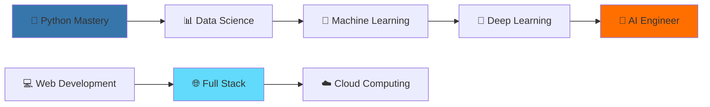

# Hi there! 👋 I'm Tegar Roofi Pangestu

<div align="center">
  
[](https://git.io/typing-svg)


[](https://github.com/TegarRoofi)
[](https://github.com/TegarRoofi)

</div>

## 🚀 About Me


```python
class TegarRoofi:
    def __init__(self):
        self.name = "Tegar Roofi Pangestu"
        self.role = "SMK Student & Aspiring AI/ML Engineer"
        self.location = "Tebo, Jambi, Indonesia 🇮🇩"
        self.languages = ["Python", "HTML", "CSS", "JavaScript", "PHP", "SQL"]
        self.design_tools = ["Photoshop", "Premiere Pro", "Lightroom", "Figma", "CorelDRAW"]
        self.passions = ["AI/ML", "Photography", "Design", "Video Editing", "Problem Solving"]
        self.current_focus = "Mastering Python & AI/ML Fundamentals"
        
    def say_hi(self):
        print("Thanks for dropping by! Let's build something amazing together! 🚀")

me = TegarRoofi()
me.say_hi()
```

Seorang pelajar SMK yang sedang mengejar mimpi menjadi **AI & ML Engineer**! 🎯 Passionate dalam teknologi, fotografi, dan selalu excited untuk belajar hal-hal baru. Percaya bahwa setiap line of code adalah langkah menuju masa depan yang lebih baik! ✨

---

## 💻 Tech Stack & Tools

<div align="center">

### 🔥 Currently Mastering


### 🌱 Web Development


### 🗄️ Database & Development Tools


### 🎨 Design & Creative Tools


### ⚡ Command Line Interface


</div>

---

## 📊 GitHub Analytics

<div align="center">


</div>

---

## 🏆 GitHub Achievements

<div align="center">


</div>

---

## 🎨 Beyond Coding

<div align="center">

| 🌟 **Passions** | 📝 **Description** |
|:---|:---|
| 📸 **Photography** | Capturing moments and stories through lens |
| 🎨 **Design & Editing** | Creating visual experiences with Adobe Creative Suite |
| 🎬 **Video Editing** | Crafting stories through Premier Pro magic |
| 🖼️ **Photo Manipulation** | Transforming ideas into stunning visuals |
| 🎯 **UI/UX Design** | Designing intuitive user experiences with Figma |
| 🧩 **Problem Solving** | Finding elegant solutions to complex challenges |
| 🤖 **AI/ML Research** | Exploring the future of artificial intelligence |

</div>

---

## 🌱 Current Learning Journey

<div align="center">


```mermaid
graph LR
    A[🐍 Python Mastery] --> B[📊 Data Science]
    B --> C[🤖 Machine Learning]
    C --> D[🧠 Deep Learning]
    D --> E[🚀 AI Engineer]
    
    F[💻 Web Development] --> G[🌐 Full Stack]
    G --> H[☁️ Cloud Computing]
    
    style A fill:#3776AB
    style E fill:#FF6F00
    style G fill:#61DAFB
```

</div>

### 🎯 2024 Goals & Progress

- ✅ **Master Python Basics** - *Completed!*
- 🔄 **Build 5+ Python Projects** - *In Progress (2/5)*
- 🔄 **Learn ML Fundamentals** - *In Progress*
- 🔄 **Create Photography Portfolio** - *Planning Phase*
- 🎯 **Land First Tech Internship** - *Goal for 2024*
- 🆕 **Contribute to Open Source** - *Starting Soon*

---

## 🚀 Featured Projects

<div align="center">

### 🌟 Live Projects & Demos
*Currently building amazing projects... Stay tuned!* 🚧

[](https://roofi.wuaze.com)


</div>

---

## 📈 Contribution Graph

<div align="center">

[](https://github.com/ashutosh00710/github-readme-activity-graph)

</div>

---

## 💡 Fun Facts & Quotes

<div align="center">

> *"Dari SMK di Tebo tapi bermimpi besar di dunia AI! 🌟*  
> *Percaya kalau coding itu seperti fotografi - keduanya tentang menangkap momen yang tepat, melihat detail yang terlewat, dan menciptakan sesuatu yang bermakna dari perspektif unik."* 📸✨

### 🎲 Random Developer Joke


### ⏰ Time Zone
🕐 **Current Time in Jambi:** 

### 🎵 Currently Listening
[](https://open.spotify.com/user/31ycagrld5k2bkx2kn4d3plqk4zy)


</div>

---

## 🤝 Let's Connect & Collaborate!

<div align="center">

### 📱 Find Me On

[](https://linkedin.com/in/tegarroofi)
[](https://instagram.com/tegarroofi)
[](https://youtube.com/@tegarroofi)
[](https://tiktok.com/@tegarroofi)

[](mailto:tegarroofi@gmail.com)
[](https://tegarroofi.dev)


### 💌 Get In Touch
*Always open to collaborate, learn together, discuss tech trends, photography tips, or just chat about life! Feel free to reach out!* 🚀

**Response Time:** Usually within 24 hours ⚡  
**Best Time to Reach:** Weekdays 9 AM - 6 PM (WIB) 🕘

</div>

---

<div align="center">

---

## 🎮 Interactive Elements

<div align="center">

### 🐍 Snake Game Animation


### 🔥 Contribution Streak Flame
[](https://git.io/streak-stats)

### 📊 3D Contribution Graph


### 🎯 Coding Activity Heatmap
[](https://github.com/ashutosh00710/github-readme-activity-graph)

### 🎲 Dynamic Quote Generator


### ⚡ Metrics Dashboard


</div>

---

## 🌟 *"Learning today, building tomorrow, inspiring always"* ✨

### 📊 Profile Summary


### 🏆 Achievement Showcase
<div align="center">
  
  
</div>

*Thanks for visiting my profile! Don't forget to ⭐ star some repositories if you find them interesting!*  
*Let's build the future together, one commit at a time!* 🚀

**Last Updated:** July 2024 📅


</div>
